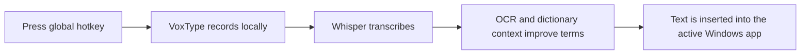

<p align="center">
  
</p>

# VoxType

VoxType is a Windows-first, local-first dictation app for people who want fast speech-to-text across real desktop apps.

Press a global hotkey, speak naturally, and VoxType transcribes locally with Whisper, uses screen and app context when available, then inserts the result back into the app you were using.



## What It Does

- **Dictates into Windows apps** through global hotkeys, active-window detection, and reliable insertion paths.
- **Keeps core data local**: transcription, OCR context, dictionary behavior, correction memory, and insertion are designed to run on the machine.
- **Uses local Whisper runtimes** with managed model and runtime downloads.
- **Understands screen context** by reading visible text with local OCR and using those terms to improve dictation.
- **Adapts per app** with profiles for insertion mode, writing style, language, and send-after-insert behavior.
- **Handles remote and legacy targets** with clipboard paste, remote clipboard paste, Unicode typing, chunked typing, and Windows Messaging experiments.
- **Records through a native Windows helper** with local Silero VAD silence trimming.

## Visual Proof

The release UI is intentionally setup-focused: users configure language, startup behavior, hotkeys, models, profiles, dictionary entries, and history while everyday dictation happens from other Windows apps.

Screenshots will be added as release assets settle. The key product loop is:

1. Configure a model and hotkey in VoxType.
2. Focus any Windows app.
3. Press the dictation hotkey.
4. Speak.
5. VoxType inserts the transcript into the focused app.

## Current Status

VoxType is preparing its first public GitHub release. Early installers are expected to be unsigned, so Windows SmartScreen may warn before installation.

Until signing is in place, releases should include checksums so users can verify installer downloads.

## Try It

1. Download the latest `VoxType-Setup-*-x64.exe` installer from GitHub Releases.
2. Run the installer.
3. Start VoxType and choose a model, hotkey, and insertion settings.
4. Focus another Windows app and press the dictation hotkey.

## Development

```powershell
bun install
bun run build
```

Useful scripts:

- `bun run dev`: start the Electron development app.
- `bun run build`: typecheck and build the Electron app.
- `bun run build:native:release`: build the Rust Windows helper.
- `bun run release:win`: build the native helper and Windows installer.

## Project Notes

The living product and architecture notes are in [planning/](planning/README.md).

## License

License information will be added before broader distribution.
